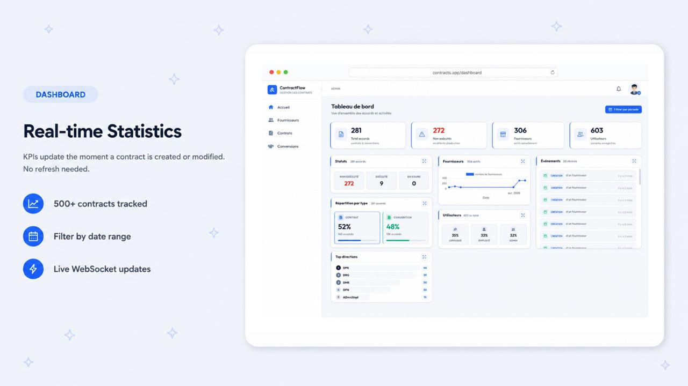
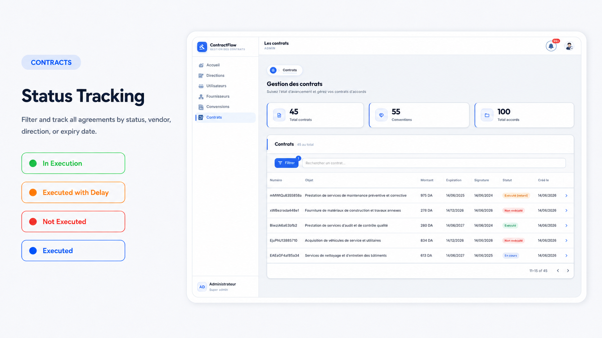
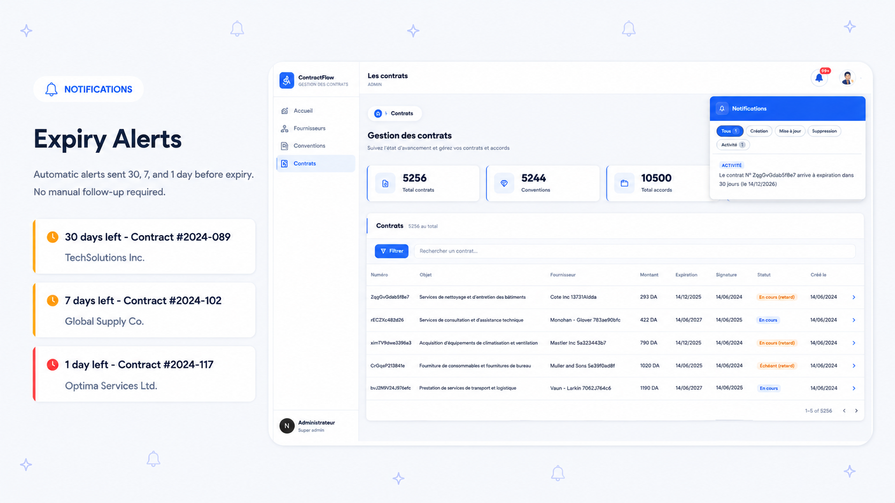
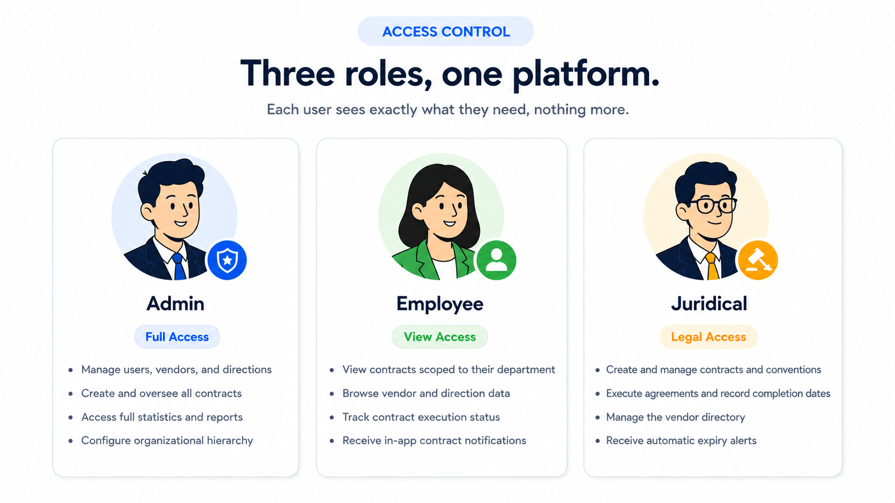
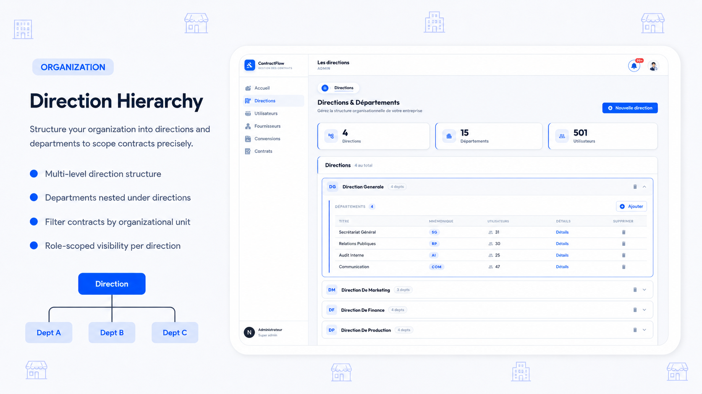
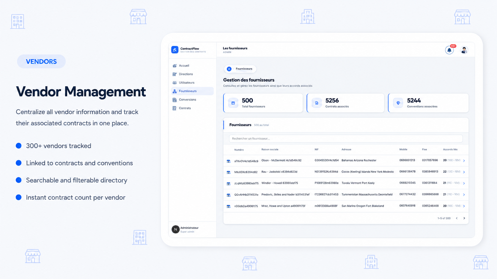

# Contract Management Platform


This is a full-stack system I built for a client during an internship to centralize how they manage contracts and conventions. It handles everything from vendor relationships to tracking execution statuses and automated expiry deadlines.

The main technical goal was to ensure the UI feels alive. I used a combination of Socket.io and a Redis Pub/Sub broker so that any change—like creating a contract or completing an execution—is reflected on every connected user's dashboard instantly, without them having to refresh or poll the server.

> This project predates AI-assisted coding—work started with the [first commit](https://github.com/stormsidali2001/contracts-management/commit/91f88d9167c5f222fdd3e04f94624bbab935b47c) on 2022-09-06. Claude was later used only for a large UI and architecture refactoring pass.

---

## What it does

### Real-time Dashboard

The dashboard provides a live look at the organization's KPIs. Since it uses WebSockets, the charts and status cards update the moment data changes in the database.

### Contract Tracking

Users can filter through hundreds of agreements by vendor, department, or date. Each contract is assigned one of six statuses (like "Executed with Delay" or "Not Executed") which are calculated on the fly based on their dates.

### Expiry Alerts

A background job runs every morning to find contracts nearing their end. It automatically pushes alerts to Juridical users at the 30, 7, and 1-day marks so no deadline is missed.

### Access Control

The platform uses role-based access for Admins, Employees, and Juridical staff. Everyone has a tailored view of the data based on what their role requires.

### Organizational Structure

The system mirrors the company's hierarchy, dividing everything into directions and sub-departments. This makes it easy to scope contracts and filter stats by specific units.

### Vendor Directory

A central place to manage vendor info, linked directly to every contract they've signed with the organization.

### Onboarding Tour

New users get an interactive walkthrough the first time they log in. The tour is role-aware, so an Admin sees different tips than a Juridical user.

---

## How it works

The backend is built with NestJS using Domain-Driven Design (DDD) and CQRS. This keeps the business logic separated from the infrastructure. When an event happens (like a contract expiring), it flows through an internal event bus to handlers that trigger the real-time notifications.

- **Backend:** NestJS, PostgreSQL, TypeORM, Redis (for scaling WebSockets), Socket.io.
- **Frontend:** Next.js (App Router), TanStack Query for cache management, Zustand for state.
- **Infrastructure:** Managed via Turborepo and Docker Compose.

---

## Setup

### Prerequisites
- Docker
- pnpm 10.6.3+
- Node.js 18+

### 1. Installation
```bash
git clone https://github.com/stormsidali2001/contracts-management
cd contracts-management
pnpm install
```

### 2. Infrastructure
```bash
docker compose up -d
```
This starts PostgreSQL and Redis.

### 3. Configuration
Copy the example environment files in `apps/api/.env-example` to `.env` and fill in your database and JWT secrets.

### 4. Run
```bash
pnpm dev
```

---

## Testing & Data

You can populate the database with fake data using these commands:

```bash
pnpm seed:directions
pnpm seed:users 200
pnpm seed:vendors  300
pnpm seed:agreements  500
pnpm seed:accounts
# or

pnpm seed:all 300
```

**Test Accounts:**
- **Admin:** `admin.admin` / `123456`
- **Juridical:** `juridical.adala` / `123456`
- **Employee:** `storm.sidali` / `123456`
